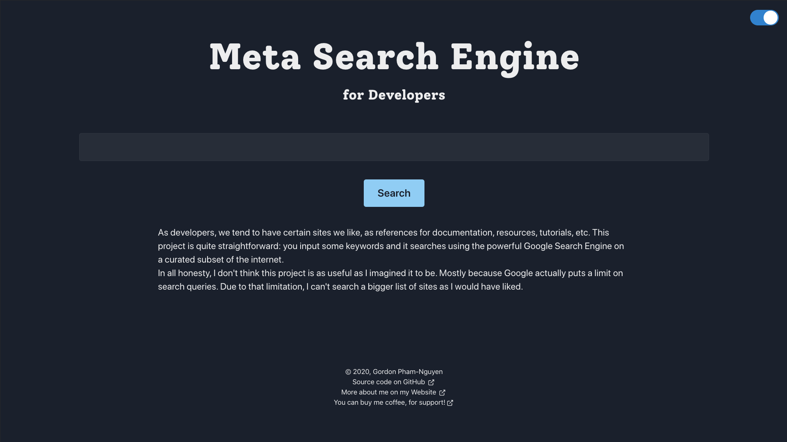

# Meta Search Engine for Developers

---

## Description

As developers, we tend to have certain sites we like, as references
for documentation, resources, tutorials, etc. This project is quite
straightforward: you input some keywords and it searches using the
powerful Google Search Engine on a curated subset of the internet.

In all honesty, I don't think this project is as useful as I
imagined it to be. Mostly because Google actually puts a character limit on
search queries. Due to that limitation, I can't search a bigger
list of sites as I would have liked.

## Screenshot

## Technologies / Built With

- TypeScript
- Next.js (and React.js)
- Emotion, CSS-in-JS
- Chakra UI

## Development

Install dependencies with `npm install`

Run the development server with `npm run dev`

Bring up the docker service with `make up`

Build and export static files into a `.out` directory with `npm run export`

## Roadmap

Check out the [open issues](https://github.com/gordonpn/dev-meta-search/issues?q=is%3Aissue+is%3Aopen+sort%3Aupdated-desc) for ideas and features I have planned!

## Support

You may open an issue for discussion.

## Authors

Myself [@gordonpn](https://github.com/gordonpn)

## License

[MIT License](./LICENSE)
